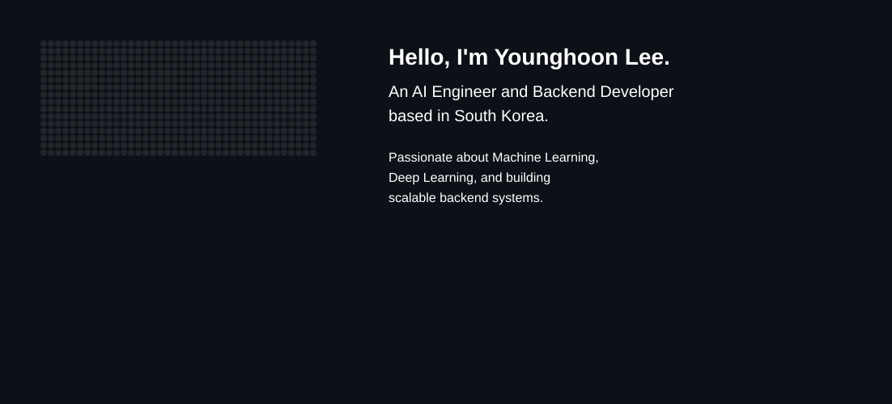

## I am

    
    &nbsp;
    &nbsp;
    
    &nbsp;
    &nbsp;
    

## Social media

    
    &nbsp;
    &nbsp;
    
    &nbsp;
    &nbsp;
    

## Lovely things

    
    &nbsp;
    &nbsp;
    
    &nbsp;
    &nbsp;
    
    &nbsp;
    &nbsp;
    
    &nbsp;
    &nbsp;
    
    &nbsp;
    &nbsp;
    

    
    &nbsp;
    &nbsp;
    
    &nbsp;
    &nbsp;
    
    &nbsp;
    &nbsp;
    
    &nbsp;
    &nbsp;
    

